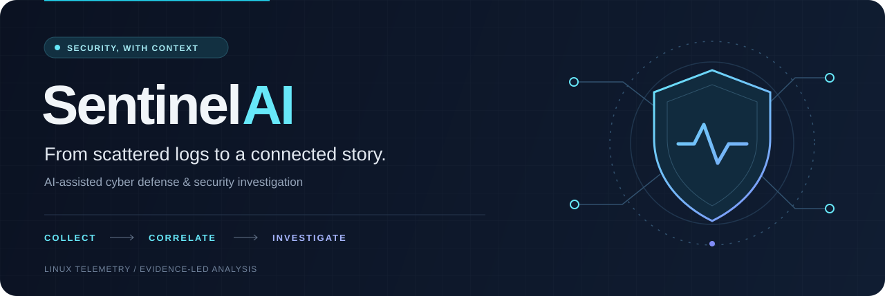
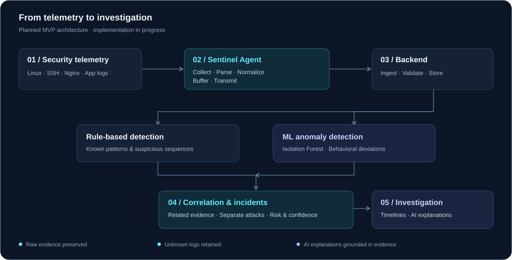

<div align="center">



<br>

**AI-assisted cyber defense & security investigation**

Linux telemetry. Evidence-based detection. Connected attack timelines.


[Overview](#overview) · [Architecture](#architecture) · [Attack correlation](#attack-correlation) · [Progress](#progress) · [Demo goals](#demo-goals)

</div>

## Overview

An attack rarely lives in a single log line. Failed logins, a successful session, and suspicious privilege use may be pieces of the same story.

**SentinelAI** is a cybersecurity investigation MVP designed to collect Linux security telemetry, detect suspicious behavior, and connect related events into incidents that a human can investigate. Rules and anomaly detection supply the evidence; AI helps explain it.

> **The central question:** Which events belong to the same attack—and which should remain separate?

Built as a **two-semester final year project**, SentinelAI focuses on a practical path from raw logs to understandable attack timelines.

## What the MVP aims to deliver

| Capability | Purpose |
| :--- | :--- |
| **Collect & normalize** | Convert Linux, Nginx, and application logs into a common event structure. |
| **Detect suspicious activity** | Combine rules for known patterns with planned Isolation Forest anomaly detection. |
| **Connect the evidence** | Correlate related events while keeping unrelated activity in separate incidents. |
| **Reconstruct the attack** | Present event sequences as investigation timelines, with attack graphs as a later extension. |
| **Prioritize investigation** | Use distinct risk and confidence scores to communicate danger and detection certainty. |
| **Explain with AI** | Summarize incidents and suggest investigation steps grounded in collected evidence. |

These describe the target MVP. See [Progress](#progress) for the current implementation status.

## Architecture



| Layer | Responsibility |
| :--- | :--- |
| **Sentinel Agent** | Collect, parse, normalize, buffer, and transmit events. |
| **Backend** | Validate and store events; detect, correlate, score, and create incidents. |
| **Investigation & AI** | Surface timelines and explain the supporting evidence. |

The agent remains lightweight. Detection and cross-event correlation belong to the backend.

### Designed to preserve evidence

- **Keep the original log.** Structured events retain their raw content for investigation and debugging.
- **Preserve unknown events.** Unrecognized logs use a raw-event fallback instead of being discarded.
- **Recover from interruptions.** Local buffering and retries are planned for temporary backend or network failures.
- **Configure the source.** Log paths vary by Linux distribution and belong in configuration.
- **Ground AI in evidence.** Rules, anomaly scores, and correlated events provide the context for explanations.

## Attack correlation

The same collection of alerts can describe an isolated attack, a connected sequence, or unrelated activity. SentinelAI aims to distinguish them using **host, user, source IP, time windows, and event relationships**.

| Scenario | Intended result |
| :--- | :--- |
| Repeated failed SSH logins from one source | One brute-force incident. |
| Separate suspicious activity with unrelated context | A separate incident. |
| Failed logins → successful login → suspicious privilege use → suspicious command | One potential attack chain, when the evidence supports the relationship. |

```text
Failed SSH logins → Successful login → Privilege use → Suspicious command
└──────────────────── Potential incident ─────────────────────────────┘
```

Shared attributes are correlation signals, not proof by themselves. The timeline should make the relationship between events inspectable.

**Risk** describes how dangerous the activity appears. **Confidence** describes how certain the system is about its interpretation. Both are planned outputs; the scoring model is still to be finalized.

## Agent design

```text
Log source → Collector → Parser → Normalizer → Buffer → Transport → Backend
                            │
                            └─ Unrecognized log → Raw-event fallback
```

Python handles the parsing workflow, while YAML patterns define recognizable authentication messages. The existing design covers SSH authentication and session-related events through an extensible parser structure.

Key files described in the project handoff:

```text
agent/
├── config/                     # Configuration and source settings
├── parser/
│   ├── base.py                 # Shared parser interface
│   ├── auth.py                 # Authentication parsing
│   └── loader.py               # Parser loading
├── model/
│   └── event.py                # Common event model
└── patterns/
    └── auth_patterns.yaml      # Authentication recognition patterns
```

<details>
<summary><strong>Example normalized event</strong></summary>

Illustrative schema; optional fields depend on the source event.

```json
{
  "event_id": "evt-001",
  "timestamp": "2026-10-03T03:20:15Z",
  "host_id": "server-01",
  "source": "linux",
  "source_type": "auth",
  "event_type": "authentication",
  "action": "login_failed",
  "user": "admin",
  "source_ip": "192.0.2.10",
  "raw_log": "Oct 03 03:20:15 server sshd[1234]: Failed password for invalid user admin from 192.0.2.10 port 4567 ssh2",
  "metadata": {}
}
```

</details>

## Progress

**Current focus: completing a reliable Linux Sentinel Agent.**

Status below reflects the project handoff; it is not a release or test certification.

| Stage | Status |
| :--- | :--- |
| Configuration loader & configurable Linux log paths | Implemented |
| Base parser, event model & authentication parser | Implemented |
| YAML authentication patterns | Implemented |
| Unknown-event fallback strategy | Defined |
| Complete collection → buffering → backend transport flow | Current development focus |
| Backend ingestion, storage & rule engine | Planned |
| Correlation, incident creation & timelines | Planned |
| Isolation Forest, risk & confidence scoring | Planned |
| AI-assisted investigation & dashboard | Planned |

### Development path

1. **Reliable collection** — complete the agent and validate live logs, malformed input, fallback behavior, and recovery.
2. **Evidence to incidents** — add backend ingestion, storage, rules, correlation, and timelines.
3. **Assisted investigation** — introduce anomaly detection, scoring, evidence-grounded AI summaries, and the dashboard.

### Running the project

Installation commands and service configuration will be documented alongside the runnable components. The handoff does not yet establish a verified end-to-end setup procedure.

## Demo goals

The final demonstration should make three outcomes visible:

- **Collection:** a real Linux log becomes a normalized event received by the backend.
- **Separation:** unrelated suspicious activity produces distinct incidents.
- **Correlation:** related activity forms a single attack chain with a readable timeline and an evidence-grounded explanation.

## Scope

SentinelAI targets a demonstrable research and engineering MVP. Enterprise-scale ingestion, kernel monitoring, full SIEM/EDR/XDR/SOAR coverage, complete MITRE ATT&CK mapping, and automated response remain outside the current scope.

---

<div align="center">

**Collect the signals. Connect the evidence. Understand the attack.**

</div>
